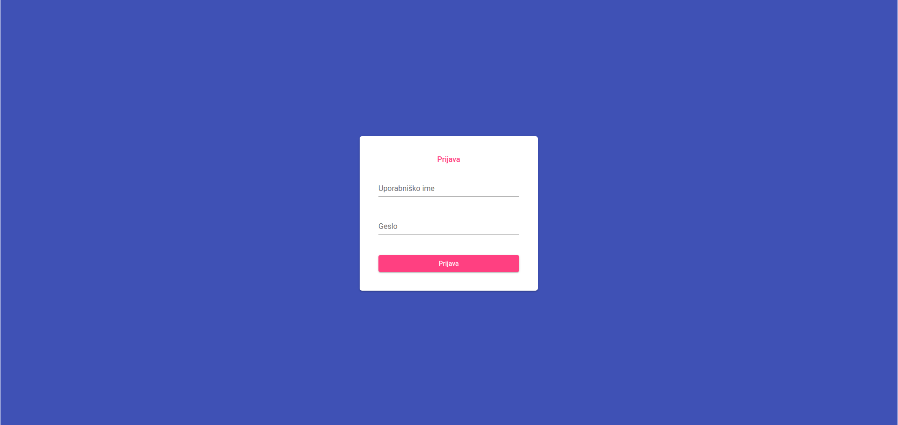
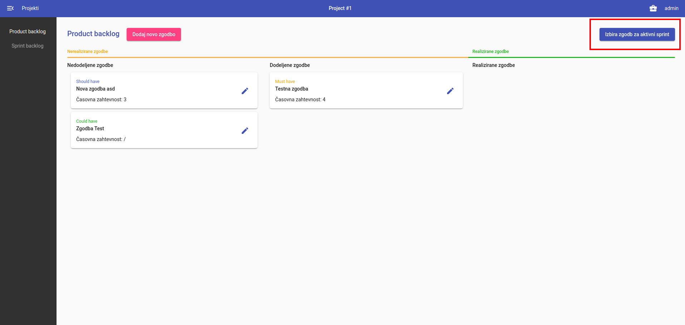

# SMRPO-PO2 backend

## Dokumentacija
[Namestitev zalednega dela](doc/install.md)\
[Dokumentacija API](doc/API.md)\
[Wiki](https://github.com/FRI-SMRPO-2/smrpo_backend/wiki/ "Wiki")

### Uporabniška dokumentacija
[Prijava v sistem](#prijava-v-sistem)\
[Dodajanje uporabnikov](#dodajanje-uporabnikov)\
[Dodajanje zgodb v Sprint](#dodajanje-zgodb-v-sprint)

#### Prijava v sistem
Uporabnik se lahko prijavi v sistem z uporabniškim imenom in geslom. 

#### Dodajanje uporabnikov
Administrator sistema lahko vnaša nove uporabnike v sistem.\
S klikom na kovček (desni zgornji kot) lahko dostopa do administratorskega vmesnika.
\
Nato se s klikom na gumb **Dodaj uporabnika** odpre okno za dodajanje uporabnikov.
Določi jim uporabniško ime in geslo, osebne podatke (ime, priimek, e-pošta) in sistemske pravice (administrator sistema, uporabnik sistema).

#### Dodajanje zgodb v Sprint
Skrbnik metodologije lahko dodaja nove zgodbe v Sprint.\
Na zavihku **Product backlog** v desnem zgornjem kotu klikne na gumb *Izbira zgodb za aktivni sprint*.
Nato izbere dogovorjeno podmnožico zgodb v seznamu zahtev in jih dodeli Sprintu.
Izbere lahko le tiste zgodbe, ki že imajo ocenjeno časovno zahtevnost in še niso bile realizirane.

